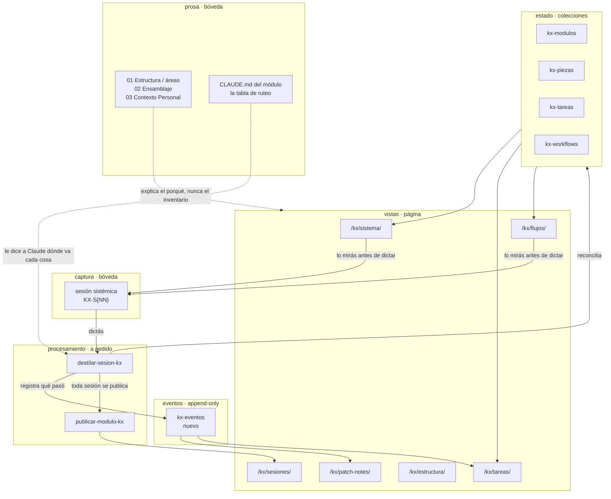

> Este documento responde a la sesión donde dictaste la dirección del andamio: las cuatro categorías del módulo, los patch notes, los dos tipos de sesión, y toda la parte visual (organigramas, flujos, árbol de carpetas). El plan anterior (hoy en `0X - Deprecated/Documentos/Plan de Construccion - Input, Estado y Dashboard.md`) resolvió *dónde vive la verdad*. Este resuelve *cómo se acumula*, que es una pregunta distinta y es la que estabas haciendo.


## 0. La diferencia con el plan anterior, en una línea

| | Plan de Construcción (25/26.07) | Este plan |
|---|---|---|
| Pregunta | ¿Dónde vive el estado del sistema? | ¿Cómo se acumula la historia del sistema? |
| Respuesta | Markdown tipado en la página, el HTML es proyección | Tres capas con reglas de mutación distintas: estado, eventos, prosa |
| Qué produjo | 4 colecciones, 2 dashboards, 2 skills, 1 template | Este documento, y las etapas de abajo |
| Qué dejó afuera | La acumulación en el tiempo, el andamio de carpetas, lo visual | Nada de eso, es exactamente el alcance de acá |

El plan anterior está **vigente y no se contradice**. Lo que sigue lo extiende.


## 0.1 Estado: las decisiones ya están resueltas

Este documento se escribió como propuesta a partir de `KX-S01`. **`KX-S02`, del mismo día, resolvió las seis decisiones de §7**, y las etapas A y B ya están ejecutadas. Lo que leés abajo es el razonamiento completo, con las resoluciones marcadas donde corresponde.

| Decisión | Resolución |
|---|---|
| Nombres de carpeta | `01 - Estructura`, `02 - Ensamblaje`, `03 - Contexto Personal` |
| Tipos de sesión | **Una sola sesión, sin `proposito`.** Se descartó la propuesta de §3.5 |
| Tareas y pendientes | Un solo store, como se propuso |
| Dónde vive el patch notes | En `02 - Ensamblaje/Patch Notes/`, un archivo por mes. **No como colección de la página** |
| La junction de Windows | Desestimada. Era otra cosa, ver §2.5 |
| `kx-funcionalidades` | Desestimada como pregunta |

Lo operativo del andamio ya construido vive en `00 - Kx Core Module/CLAUDE.md`, que es la tabla de ruteo. Este documento es el porqué; ese es el cómo.


## 1. El reencuadre: las cuatro categorías no son cuatro temas

Dictaste cuatro categorías (Structure, Implementation Site, Personal Context, y Second Brain Technical Knowledge en el freezer). Quedaron tres, porque la cuarta se fue afuera del módulo (ver §9). Si las leo como carpetas temáticas, no tengo criterio para decidir dónde va algo nuevo, y voy a preguntarte cada vez. Si las leo como **cuatro tipos de pregunta**, el criterio se vuelve automático:

| # | Categoría | La pregunta que contesta | Cómo cambia |
|---|---|---|---|
| 1 | **Estructura** | ¿Qué existe y cómo está armado? | Se sobrescribe. El presente pisa el pasado |
| 2 | **Ensamblaje** | ¿Qué pasó, y qué sigue? | Se agrega. Nunca se pisa nada |
| 3 | **Contexto Personal** | ¿Para quién es esto y bajo qué restricciones? | Se reescribe despacio, a mano, dictando. **Lo llena Teo, no la IA** |
| 4 | *(Conocimiento técnico)* | ¿Qué sé? | Fuera de alcance, y ver §9 |

**"Ensamblaje" en vez de "Implementation Site"**: es una palabra, es español, y dice lo que la categoría hace. Fue la elección de Teo en `KX-S02` sobre la propuesta original ("Obra"), y es mejor: ensamblar es juntar piezas que ya existen en algo que funciona, que es exactamente lo que pasa acá.

### 1.1 La consecuencia real: tres semánticas de mutación

Esto es lo importante del reencuadre, y es lo que resuelve el problema de duplicación que tenía este diseño escondido adentro.

```
ESTADO      mutable, se sobrescribe    ¿qué hay ahora?      colecciones kx-* en la página
EVENTOS     append-only, nunca se pisa ¿qué pasó y cuándo?  02 - Ensamblaje/Patch Notes/
PROSA       autorada, se reescribe     ¿por qué es así?     archivos de área en la bóveda
```

> **Resuelto en KX-S02:** la capa de eventos vive como markdown en la bóveda, un archivo por mes subdividido por días, no como colección de la página. Se descartó la propuesta de `kx-eventos`. El costo de esa elección es concreto y conviene tenerlo escrito: **el log no se puede renderizar en `/kx/` ni consultar por área hasta que exista una colección.** La ganancia es que se lee y se escribe desde Obsidian sin intermediarios, que es donde Teo está cuando quiere saber qué pasó.

Cuando dijiste *"un documento que sea todas las skills, y que cuando yo agregue una se agreguen ahí, con una descripción relativamente comprensiva"*, estabas pidiendo dos cosas a la vez: el **inventario** de skills (que ya existe, son los 15 archivos de `kx-piezas/`) y la **prosa** que explica qué es la capa de skills, cómo se nombran, qué convenciones tienen, qué se decidió y qué queda abierto. La primera ya está resuelta. La segunda no existe todavía, y es la que va a los archivos de área.

Si el archivo de prosa además lista las skills, tenés el inventario en dos lados. Y el segundo va a quedar viejo. Siempre queda viejo.

### 1.2 La regla dura que sostiene todo esto

> **La prosa nunca enuncia inventario. El inventario siempre se renderiza.**

Un archivo de área puede decir *"las skills se nombran en kebab-case, verbo primero, y viven en `.claude/skills/{nombre}/SKILL.md`"*. No puede decir *"hoy hay siete skills: limpieza-outie, limpieza-innie, ..."*. Eso lo dice `/kx/anatomia/`, que lo lee de los archivos y no puede mentir.

Si hay una sola regla que retengas de este documento, es esta. Es la que decide si dentro de tres meses la metaestructura te sirve o te miente. Y el costo de que mienta no es solo tuyo: **Claude también la lee**, y una metaestructura vieja es peor que ninguna, porque desplaza la lectura del estado real.


## 2. Diagnóstico: qué falta de verdad hoy

No hipótesis, esto es lo que salió de leer el sistema como está.

### 2.1 El sistema no tiene log de eventos

Es el hallazgo principal y es el que justifica los patch notes como pieza de arquitectura y no como capricho.

Las colecciones guardan **estado presente**. El campo `actualizado` se pisa cada vez que se toca un objeto, así que solo sabés *cuándo fue la última vez*, nunca *qué pasó*. Todo lo que pediste en la sesión (el timetable de implementaciones, *"cuándo fue la última vez que se hizo esto"*, *"cuáles fueron las últimas skills"*, patch notes diarios y semanales) es una consulta sobre un log que no existe.

Los patch notes no duplican nada. **Son el primitivo que falta.**

Y con el log, dos cosas que hoy son imposibles se vuelven triviales: la vista por temperatura (qué está frío) y la respuesta a *"quiero seguir con skills"*.

### 2.2 Nada conecta una tarea con su capa

Pediste poder decir *"quiero seguir con algunas skills"* y recibir: últimas skills tocadas, qué se hizo, qué tareas quedan de skills, cuáles hay que crear y cuáles arreglar.

Hoy `kx-tareas` tiene `modulo`, pero no tiene nada que diga *de qué área del núcleo es esta tarea*. Las 47 tareas cargadas apuntan casi todas a `modulo-base`, que es tan grueso que no filtra nada. Falta **un campo**. Es la intervención más chica del documento y la que desbloquea el caso de uso que más repetiste.

### 2.3 Los flujos son lo que más querés ver, y no hay un solo dato cargado

`kx-workflows` está vacía. `kx-cuadrantes` está vacía. Dijiste tres veces, con palabras distintas, que necesitás ver los flujos de las instancias mientras dictás, para poder dictar mejor. Es la brecha más grande entre lo que querés mirar y lo que hay.

Y es barata de cerrar: los pipelines reales ya existen y están documentados en las skills. Son cinco o seis. Cargarlos es una hora.

### 2.4 La taxonomía vive en JSX

`anatomia.astro` tiene la taxonomía (ids, estados, tipos de tarea, patrones de naming) hardcodeada en cuatro arrays de JavaScript. Es exactamente la Opción A que el plan anterior descartó por escrito: verdad viviendo en el HTML.

No es urgente (cambia poco), pero **sí importa que haya una sola versión autoritativa en texto**, porque el `CLAUDE.md` del módulo la va a citar y no puede citar un array de JSX. Ver §6.B.

### 2.5 Hay dos lugares que quieren ser "el lugar donde está todo"

Dijiste: *"la idea es que todo el sistema esté contenido ahí, tipo no hay carpetas que no se encuentran ahí"*.

Hoy el sistema vive en dos árboles hermanos: la bóveda de Obsidian y el repo de la página. Es la decisión correcta por razones técnicas (los objetos tienen que estar donde Astro los lee y donde git los versiona), pero desde Obsidian no ves la mitad del sistema.

> **Aclarado en KX-S02: leí mal el pedido.** No era sobre montar el repo dentro de la bóveda (la junction de Windows quedó desestimada). Era sobre `01 - Estructura/`: que **no haya ninguna estructura ni sistema que no esté representado en alguna de sus áreas.** Eso es una regla de completitud sobre los once archivos de área, no un problema de filesystem, y es más fuerte que lo que yo había entendido: obliga a que cada vez que aparece algo nuevo en el sistema, tenga un lugar donde ser nombrado.

La consecuencia operativa de la aclaración: **si algo del sistema no encaja en ninguna de las once áreas, o falta un área o el ítem no es del sistema.** No hay tercera opción, y eso hace del conjunto de áreas algo verificable en vez de una lista de cajones.

### 2.6 Ya hay sprawl de colecciones, y este plan agrega presión

Hay ocho colecciones `kx-*`, dos vacías, y dos (`kx-funcionalidades`, `kx-integraciones`) cuya diferencia con `kx-piezas` no está escrita en ningún lado. El plan anterior argumentó explícitamente a favor de **una colección con campo `tipo`** en vez de una por subcategoría, y la página derivó de eso sin decidirlo.

Consecuencia para este plan: **cada colección nueva tiene que pasar un test**, y solo una lo pasa.

> **Test:** ¿esta colección responde una pregunta que hoy no se puede responder de ninguna forma?
>
> - `kx-eventos` → sí. No hay ningún lugar donde esté qué pasó y cuándo. **Pasa.**
> - `kx-sesiones` → sí, marginalmente. Hoy las sesiones existen como archivos de bóveda invisibles para la página. **Pasa.**
> - `kx-capas` → no. La escalera de abstracción es prosa, y la capa de un objeto es derivable de en qué colección vive. **No pasa.**
> - `kx-taxonomia` → no todavía. Cambia dos veces por trimestre. Prosa citable alcanza. **No pasa.**
> - `kx-instancias` → no. Una instancia y su template son la misma cosa vista de los dos lados, y el template ya es `kx-piezas` tipo `template`. **No pasa.**

Dos colecciones nuevas, no siete.

### 2.7 La sesión de ayer no tiene id ni frontmatter

`26.07.26 - Class Kx Core.md` la escribiste a mano, sin el template. No seguía el naming, no tenía frontmatter, y por lo tanto `destilar-sesion-kx` no podía correr sobre ella.

Es un síntoma útil, no un error tuyo: la fricción apareció exactamente en el momento de más entusiasmo, que es el peor momento para tener fricción. Se normaliza en la etapa A y el template lo evita para siempre.

En este documento la cito como **KX-S01**.


## 3. El vocabulario nuevo, palabra por palabra

Mínimo deliberado. Cada término de acá tiene que ganarse el lugar.

### 3.1 Las once áreas de Estructura

Tus once subcategorías, con tres cambios y el motivo de cada uno:

| # | Área | Qué contiene | Cambio respecto de tu draft |
|---|---|---|---|
| 1 | `modulos` | Los módulos del sistema y su relación | igual |
| 2 | `capas` | La escalera de abstracción: sistema → módulo → pieza → artefacto | definida, ver §3.2 |
| 3 | `skills` | Piezas tipo skill: catálogo, convenciones, arquitectura | igual |
| 4 | `instancias` | Las unidades atómicas y los templates que las crean | absorbe "templates" |
| 5 | `flujos` | Los pipelines que recorren las instancias | separada de instancias |
| 6 | `convenciones` | Naming, frontmatter, cómo se escribe cada cosa | igual |
| 7 | `taxonomia` | Ids, estados, tipos, terminología | igual |
| 8 | `integraciones` | Sistema con sistema, y plugins que sostienen un pipeline | plugins con criterio, ver abajo |
| 9 | `cuadrantes` | El cuadrante como unidad estructural del sistema | igual |
| 10 | `pagina` | interlynkx-page: qué colección alimenta qué vista | igual |
| 11 | `mapas` | Las vistas del sistema: organigramas, cursogramas, árbol | igual |

**Cambio 1: "Instancias y Flujos" se parte en dos.** Una instancia es una unidad que viaja (una stream session, una sesión sistémica, una entrada de bullet journal, un batch de treats, un ensayo). Un flujo es el pipeline que recorre. Son dos ejes distintos, y el diagrama que querés mirar mientras dictás los necesita separados: instancias en las filas, etapas del flujo en las columnas. Colapsados en una sola área, ese diagrama no se puede dibujar.

**Cambio 2: los templates entran en `instancias`.** Un template y su instancia son la misma cosa vista desde dos lados: el template la crea, la instancia es el resultado. Separarlos garantiza que se desincronicen.

**Cambio 3: "Raw Materials + carpetas tocadas solo por la IA" deja de ser un área.** No es un tema, es un **atributo** de las carpetas y los archivos: quién escribe ahí. Como área es un cajón donde nunca ibas a entrar; como campo (`autoria`, §3.4) es exactamente el color que pediste en el organigrama. Es el mismo dato haciendo un trabajo útil en vez de ocupar una carpeta.

**Sobre plugins.** Un plugin de Obsidian puede ser infraestructura de verdad (Templater crea tus sesiones, sin él no hay input) o comodidad (editing-toolbar, smart-typography). El criterio: **¿se rompe un pipeline si lo saco?** Si sí, es `integraciones` en Estructura. Si no, es stack en Contexto. Templater, Full Calendar y Dataview son integraciones. El resto es stack.

### 3.2 `capa`: qué es y qué no

Usaste "capa" de dos formas en la sesión: como sinónimo de subcategoría (*"cada subcategoría va a ser como una capa"*) y como nivel de abstracción (*"qué skill y qué módulo o qué capa"*). Propongo fijarla en el segundo sentido:

```
sistema      el kx system entero
  módulo     kx core module, kx sesiones module, ...
    pieza    una skill, un flujo, un template, una convención
      artefacto   un archivo concreto que la pieza produce
```

**Área es de qué tema. Capa es a qué distancia.** Son ejes perpendiculares: una skill de la capa `pieza` puede estar en el área `flujos`.

Y el punto práctico: **`capa` no necesita ser un campo.** La capa de un objeto se deriva de en qué colección vive. El área `capas` existe para tener la escalera escrita en un lugar, no para taggear nada.

### 3.3 `permanencia`: `fija` o `andamio`

Dijiste que era importante distinguir *"cuáles carpetas son fijas y cuáles están siendo utilizadas de andamios y de utilización auxiliar de proyecto"*. Es importante por una razón que va más allá del orden: **una carpeta andamio se puede borrar sin culpa, y una fija no.** Sin la marca, ninguna se borra nunca, y el árbol solo crece.

`05 - kx system creation/` es el caso obvio: es andamio, y este documento acaba de moverle el centro de gravedad.

### 3.4 `autoria`: `teo`, `ia`, `mixta`

Quién escribe en esa carpeta. Es el color que pediste para el organigrama, y tiene un segundo uso: una carpeta `ia` que hace dos semanas que no cambia significa que un pipeline dejó de correr. Una carpeta `teo` que hace dos semanas que no cambia significa que estuviste ocupado. **El mismo silencio significa cosas distintas según quién escribe**, y sin el campo no se puede distinguir.

### 3.5 Los tipos de sesión: propuesta descartada

> **Resuelto en KX-S02, en contra de lo que propuse acá.** Queda **una sola sesión kx core, sin `proposito`**: se dicta primero, se trata siempre igual con el doble HTML, y después se decide a dónde va cada cosa según lo que el contenido sea. Los cuatro valores de `proposito` (`explorar`, `decidir`, `especificar`, `descargar`) salieron del sistema, y el quinto que propuse abajo nunca existió.

Dejo el razonamiento porque la mitad sigue siendo válida y porque conviene tener escrito qué se descartó.

Lo que pediste en `KX-S01` fueron dos tipos de sesión: una de implementaciones ("esto lo quiero hacer ya, armemos un plan") y una abierta (funcionalidades, tecnología, objetivos futuros), con las de implementación en una subcarpeta.

**Lo que sigue en pie: no la subcarpeta.** Una carpeta te obliga a clasificar la sesión antes de hablar, y muchas veces la sesión resulta ser otra cosa que la que arrancaste. Cuando eso pasa con un campo, se cambia una palabra. Cuando pasa con una carpeta, hay que mover el archivo y arreglar links, y en la práctica no se hace. Esto se mantuvo: hay una sola carpeta de sesiones.

**Lo que se descartó: el campo.** Yo proponía un quinto valor `implementar` que disparara un pipeline distinto (plan por etapas, doble HTML, publicación) frente a los otros cuatro. Vos preferiste sacar el campo entero.

**Por qué tu decisión es mejor de lo que yo proponía**, y no es cortesía: mi diseño ponía la clasificación **antes** del dictado, que es exactamente el error que yo mismo estaba criticando en la subcarpeta. Un campo elegido en un suggester al crear la nota es una carpeta con otra forma. Sacarlo mueve la clasificación al único momento donde se puede hacer bien, que es después de haber hablado.

**El costo, para tenerlo escrito.** Sin `proposito`, la destilación pierde la única señal declarada de qué tipo de sesión es, y tiene que inferirla del texto. Queda `conclusiva` como la única señal explícita, y por eso pasa a importar más que antes: es lo que separa "esto lo decidí" de "esto lo estaba pensando en voz alta".

### 3.6 `tareas` y `pendientes` son lo mismo

Vos mismo lo marcaste (*"esta parte de task hub y pendientes se podría repensar un poco"*). Sí: son un solo store.

`kx-tareas` con `estado: abierta | bloqueada | cerrada` más `tipo` ya cubre tus tres cajones: activos son `abierta`, cerrados son `cerrada`, e ideas son las `pensar` sin prioridad. Dos listas de pendientes es el patrón que mata backlogs, porque ninguna de las dos termina siendo confiable y acabás con tres.

**Ensamblaje queda con tres áreas, no cuatro:** `patch-notes`, `sesiones`, `tareas`. "Pendientes" es una vista.

### 3.7 Las áreas de Contexto Personal

Tus seis, sin cambios, un archivo cada una: `Cuadrantes.md`, `Areas de Vida.md`, `Stack Hardware.md`, `Stack Software.md`, `Interaccion.md` (tiempos, fricción, comportamiento adhd), `Objetivos.md` (qué craft querés desarrollar, qué querés crear).

Existen con el molde puesto y vacíos, y **la IA no escribe ahí**. Si de una sesión sale material de contexto personal, se señala en el reporte para que lo escribas vos. El contexto personal mal parafraseado es peor que vacío, y es la única carpeta del módulo con esta restricción.

La única nota: `cuadrantes` aparece en Estructura y en Contexto, y está bien. El cuadrante como unidad estructural del sistema es Estructura; qué hay adentro de tu cuadrante es Contexto Personal. La regla que los separa es la de §1: si lo mira el sistema para operar, Estructura; si lo mira para entenderte, Contexto Personal.


## 4. Los bucles que deciden si esto vive o se muere

Cuatro bucles importan. Dos hay que alimentar y dos hay que cortar de entrada.

### R1 · El motor (refuerzo, alimentarlo)

```
dictás → se destila → el estado se actualiza → lo ves visualmente
   → dictás más específico y más seguido → mejor destilado → ⤴
```

Es el bucle que ya está funcionando y es el que justifica todo el trabajo visual. Cuando dijiste *"esa pantalla me sirve para poder grabar la sesión de pensamiento"*, describiste este bucle: lo visual no es decoración, es el eslabón que hace que la siguiente sesión sea mejor que la anterior. **Por eso las vistas van antes de la automatización.**

### R2 · La degradación de la metaestructura (refuerzo, cortarlo)

```
la prosa enuncia inventario → el inventario cambia → la prosa queda vieja
   → desconfiás → dejás de leerla → nadie la actualiza → queda más vieja → ⤴
```

Este es el que mata metaestructuras, y mata más rápido a las buenas que a las malas, porque cuanto más completa parece, más caro es descubrir que miente. Se corta con la regla de §1.2, que no es un consejo de estilo: es la barra antivuelco de este diseño.

### R3 · El costo de destilar (refuerzo, cortarlo)

```
más colecciones y más campos → destilar cuesta más y falla más
   → destilás menos seguido → el estado queda viejo → ⤴
```

Hoy `destilar-sesion-kx` lee **todas** las colecciones enteras en cada corrida. Con 70 objetos chicos es barato. Con 300 no lo es, y es el momento exacto en que la skill empieza a omitir cosas en silencio.

Dos cortes: el test de §2.6 (no agregar colecciones que no ganen su lugar) y, cuando se pase de **unos 100 objetos**, un índice compacto generado (una línea por objeto) que la skill lea en vez de los archivos completos. No hace falta construirlo ahora, sí hace falta saber que es el arreglo cuando llegue el momento.

### B1 · La fricción de captura (balance, respetarlo)

Cada campo nuevo en el template baja el caudal de entrada. Es el driver central de todo tu sistema (*el esfuerzo se pesa hacia el final del workflow*), y es la razón por la que en §3.5 el quinto propósito es una opción más en un suggester que ya existe y no una pregunta nueva.

**Regla operativa: este plan no agrega ni un campo al momento de dictar.** Todo lo nuevo se llena al destilar o al publicar.

### B2 · El log que crece (balance, para qué sirve el semanal)

El log es append-only, así que crece sin techo, y a las tres semanas el patch notes diario es ilegible. Vos ya intuiste el amortiguador: *"el diario un poco más granular y el semanal más abstracto y meta-sistémico"*. Ese es su rol estructural, no es "otra vista linda". El semanal es un renderizado agrupado del mismo log, nunca un segundo log.


## 5. Puntos de apalancamiento, del más débil al más fuerte

Escala de Meadows aplicada a esto, para justificar el orden de las etapas:

| Nivel | Intervención | Etapa |
|---|---|---|
| Parámetros | Agregar el campo `area` a tareas y eventos | D |
| Estructura de flujos | El log de eventos: un primitivo nuevo, no un número | C |
| Reglas | "La prosa nunca enuncia inventario" + el test de colecciones | A, B |
| **Flujos de información** | **El árbol y los flujos autogenerados: cambian qué ves antes de dictar** | E, F |
| Metas | El core module deja de ser un módulo más y pasa a gobernar a los otros | A |
| Paradigma | "Estoy construyendo un sistema para construir el sistema" | ya lo tenés |

El más alto de los prácticos es **flujos de información**, y es contraintuitivo: la intervención más potente no es automatizar el destilado, es cambiar qué tenés en la pantalla en el momento de hablar. Eso reescribe el input, y el input es de donde sale todo lo demás.

El paradigma ya lo tenés y es lo que hace que este documento valga la pena. No hay nada que intervenir ahí.


## 6. Las etapas

Ordenadas por dependencia real. Cada una deja algo usable aunque las siguientes nunca se hagan.

### Etapa A · Vocabulario y normalización · hecha el 26.07.26

- [x] Las tres categorías como tres preguntas (§1), con los nombres de carpeta resueltos en `KX-S02`
- [x] Las once áreas de Estructura, las tres de Ensamblaje y las seis de Contexto Personal (§3)
- [x] Sesiones renombradas al naming nuevo (`{AA.MM.DD} - kx core session[ - {romano}]`) y con frontmatter normalizado
- [x] `proposito` eliminado del sistema: template, `CLAUDE.md` de sesiones, y `destilar-sesion-kx`
- [x] Template único: `Templates/Kx Core Session.md` reemplaza a `Sesion Sistemica.md`, sin suggester


### Etapa B · El documento de ruteo · hecha el 26.07.26

Este es el que te saca la estructura de la cabeza, y es el que pediste explícitamente cuando dijiste *"vamos a tener que armar otro Claude.md que sea cómo se dividen las categorías, las subcategorías, qué se hace, dónde se hace, cómo se hace"*.

- [x] `00 - Kx Core Module/CLAUDE.md`: las categorías, las áreas, la tabla de ruteo, la taxonomía autoritativa, la regla de §1.2, y el formato de evento
- [x] Esqueleto de carpetas: `01 - Estructura/`, `02 - Ensamblaje/`, `03 - Contexto Personal/`
- [x] Los once archivos de área, con el molde fijo de cinco secciones y sembrados con lo que ya era verdad del sistema
- [x] Los seis de Contexto Personal, con el molde y vacíos, para que los llene Teo
- [x] Puntero desde el `CLAUDE.md` raíz
- [x] `05 - kx system creation/` eliminada; sus documentos a `0X - Deprecated/Documentos/`
- [x] `Sesiones/` movida a `02 - Ensamblaje/Sesiones/`, para que todo esté representado en una categoría

**Qué quedó usable:** cualquier sesión de Claude que arranque acá sabe dónde va cada cosa sin leer la bóveda entera. Es el ahorro de tokens que pediste, y el fin de tener la jerarquía en la cabeza.


### Etapa C · El log de eventos · hecha el 26.07.26, con una variante

> **Resuelto en KX-S02:** el log vive como markdown en la bóveda, no como colección. Un archivo por mes en `02 - Ensamblaje/Patch Notes/`, subdividido por días, con el día más reciente arriba.

- [x] `02 - Ensamblaje/Patch Notes/26.07 - Patch Notes.md` creado, con el formato de línea y el criterio de qué se registra
- [x] Backfill retroactivo: los eventos reconstruibles de las fechas `actualizado` de las piezas y tareas, y de los documentos de diseño. Marcados `(retroactivo)`, porque las fechas son aproximadas y el log tiene que ser honesto sobre eso
- [x] Criterio escrito en el `CLAUDE.md` del módulo: **solo lo que cambia el estado de un objeto o cierra una decisión.** Editar la redacción de una descripción no es un evento
- [ ] **Pendiente, y es el costo de la variante:** el semanal abstracto y la vista de la página. Un archivo markdown no se puede agrupar por área ni contar sin leerlo entero, así que la segunda mitad de lo que pediste (*"el semanal más abstracto y meta-sistémico"*) queda esperando. La salida, cuando duela, es una colección `kx-eventos` alimentada desde el markdown, no en vez de él

**Qué quedó usable:** el timetable. Podés abrir un archivo y ver qué pasó cada día, y arranca no vacío, que para el bucle R1 no es un detalle.


### Etapa D · El campo `area` · 1 h

- [ ] Agregar `area` (requerido) a `kxTareas` y `kxEventos`
- [ ] **No** agregarlo a `kxPiezas`: ahí es derivable de `tipo` (skill→skills, template→instancias, flujo→flujos, convencion→convenciones, integracion→integraciones). Cero backfill, cero campo redundante
- [ ] Backfill de las 47 tareas
- [ ] `/kx/tareas/`: filtro por área, y el bloque "seguir con X" que junta las últimas tres cosas hechas en esa área más las tareas abiertas

**Qué queda usable:** *"quiero seguir con skills"* pasa a tener respuesta directa, con las últimas skills tocadas, qué queda por crear y qué por arreglar. Es el caso de uso que más repetiste en la sesión.


### Etapa E · Instancias y flujos · 1 a 1.5 h

- [ ] Cargar `kx-workflows` con los pipelines reales (están todos documentados en las skills): stream session A/C, stream session B, sesión sistémica, treats y quotes, ensayo, publicación kx
- [ ] Cerrar `KX-T22` (el catálogo de workflows) con la granularidad decidida: **un workflow por materia prima de entrada**, porque es la unidad que vos elegís cuando dictás
- [ ] Página `/kx/flujos/`: un Mermaid por flujo, cada nodo coloreado por `autoria` (vos escribís / la IA escribe), y arriba la matriz instancias por etapas

**Qué queda usable:** la pantalla que dijiste que necesitás abierta mientras dictás. Directo al bucle R1, que es el de más apalancamiento.


### Etapa F · El árbol de carpetas que se actualiza solo · 1.5 h

Pediste que el HTML de estructura se actualice cuando cambian las carpetas, y aclaraste *"no tiene que ser automático, yo le puedo decir actualizalo"*. Eso simplifica mucho el diseño.

- [ ] `scripts/snapshot-arbol.mjs`: recorre bóveda y repo, escribe `src/data/arbol.json`. Se corre a pedido ("actualizá el árbol") y el JSON se commitea
- [ ] `src/data/arbol-anotaciones.json`: por path, `{ permanencia, autoria, nota }`. Solo las excepciones, no todo el árbol
- [ ] Página `/kx/estructura/`: el árbol, coloreado por `autoria`, con las andamio marcadas visualmente

**Por qué snapshot y no leer el filesystem en build:** el sitio se buildea en GitHub Actions desde el repo de la página, y la bóveda no está en ese repo. Un `fs.readdir` funciona local y explota en CI. El JSON commiteado funciona en los dos lados, y de paso te da diffs de git sobre la forma del sistema, que es un regalo que no pedimos.

**Qué queda usable:** el árbol nunca queda viejo por más de un comando, y lo que está viejo se ve en el git diff.


### Etapa G · Sesiones como objetos publicables · 1 a 1.5 h

- [ ] Colección `kxSesiones`: `id`, `fecha`, `titulo`, `conclusiva`, `estado`, `produjo`, `href`
- [ ] Página `/kx/sesiones/`: índice de más reciente a más vieja, con el propósito como chip y links al par textual y mapa cuando existe
- [ ] Extender `destilar-sesion-kx`: registrar la sesión en `kxSesiones` y encadenar `publicar-modulo-kx` (toda sesión se publica, sin condición)
- [ ] Primera corrida real sobre KX-S01

**Qué queda usable:** el ciclo completo automático, que es lo que pediste cuando dijiste que querés combinar la skill de destilado con la del doble HTML.

**Por qué al final:** para cuando llegue esta etapa vas a tener dos o tres sesiones dictadas y este documento hecho a mano como referencia de calidad. Ese es el material de calibración real para escribir la skill bien, en vez de escribirla en abstracto.


### Etapa H · Organigrama clickeable · abierto

- [ ] `/kx/mapa/`: el organigrama del sistema, generado de las colecciones
- [ ] Toggle actual / proyectado, que es el mismo grafo filtrado por estado (`activo` y `construyendo` versus `idea` y `disenado`), no dos páginas
- [ ] Nodos clickeables hacia el objeto o su área

Queda abierta a propósito: es la que dijiste que era más a futuro, y es la que más se beneficia de que las etapas C a F ya hayan llenado la data.


### El camino crítico

```
A (vocabulario) ──▶ B (ruteo, CLAUDE.md del módulo)
                      │
                      ├──▶ C (eventos) ──▶ D (área) ──▶ G (sesiones) ──▶ H (organigrama)
                      ├──▶ E (flujos)          ← independiente
                      └──▶ F (árbol)           ← independiente
```

**A + B + C + D es el objetivo de hoy: unas 3 a 3.5 horas.** Al final de eso tenés vocabulario fijo, el documento que te saca la estructura de la cabeza, el timetable funcionando, y *"quiero seguir con skills"* contestable.

E y F son la tarde siguiente y son las de más apalancamiento visual. G y H después.

No prometo A a H en un día y no conviene: E depende de decidir la granularidad de workflows (`KX-T22`), y esa decisión se toma mejor con el log ya andando, porque el log te muestra qué flujos usás de verdad.


## 7. Las decisiones, resueltas

Las seis se cerraron en `KX-S02`, el 26.07.26. Queda la tabla completa con lo que se propuso, lo que se resolvió, y dónde está el detalle.

| # | Decisión | Lo que propuse | Lo que se resolvió |
|---|---|---|---|
| 1 | Nombres de carpeta | `01 - Estructura`, `02 - Obra`, `03 - Contexto` | `01 - Estructura`, `02 - Ensamblaje`, `03 - Contexto Personal` |
| 2 | Tipos de sesión | Un quinto `proposito: implementar` | **Ninguno.** Una sola sesión, sin `proposito`. Ver §3.5 |
| 3 | `tareas` y `pendientes` | Un solo store | Confirmado. Ver §3.6 |
| 4 | Dónde vive el patch notes | Colección como fuente, espejo en la bóveda | **Al revés:** markdown en `02 - Ensamblaje/Patch Notes/`, un archivo por mes. Ver §6.C |
| 5 | La junction de Windows | Sí, con tu confirmación | **Desestimada, y era otra cosa.** Ver §2.5 |
| 6 | `kx-funcionalidades` separada de `kx-piezas` | Sin decidir | Desestimada como pregunta. No bloquea nada |

Además, tres cosas que no estaban en esta tabla y salieron de `KX-S02`:

| Qué | Resolución |
|---|---|
| Naming de la sesión | `{AA.MM.DD} - kx core session[ - {romano}]`, espejando stream sessions. El id queda en el frontmatter |
| Nivel de encabezado | Nunca `#`, `##` ni `###` en este módulo. Se arranca en `####` |
| Los documentos narrativos viejos | A `0X - Deprecated/Documentos/`, y se migran después con orden |


## 8. Modos de falla y mitigación

| Componente | Falla | Disparador | Impacto | Mitigación |
|---|---|---|---|---|
| Prosa de área | Queda vieja y contradice al estado | Se implementa algo y solo se actualiza la colección | La metaestructura miente, y le miente a Claude también | Regla de §1.2, y el molde de archivo de área que no tiene sección de inventario |
| Log de eventos | Se llena de ruido y se vuelve ilegible | Se registra cada edición trivial | El patch notes deja de servir a las tres semanas | Criterio escrito: solo cambios de estado y cierres de decisión |
| `destilar-sesion-kx` | Costo crece sin techo, empieza a omitir en silencio | Colecciones por encima de ~100 objetos | Destilás menos, el estado envejece (bucle R3) | Índice compacto generado, con umbral definido |
| Árbol de carpetas | Desincronizado justo donde más confiás en él | Se crea una carpeta y no se corre el snapshot | Lo visual miente, que es peor que no tenerlo | Snapshot de un comando, y el semanal recuerda correrlo |
| El log en markdown | No se puede agrupar, contar ni renderizar sin leerlo entero | Que el patch notes pase de unos pocos meses | El semanal abstracto (bucle B2) no se puede producir, y el diario se vuelve ilegible | Cuando duela, una colección `kx-eventos` alimentada desde el markdown, no en vez de él |
| Sesión escrita a mano | Sin id ni frontmatter, no se puede destilar | Entusiasmo sin abrir el template | Fricción en el peor momento | El template como único camino de entrada, y normalizar a mano cuando pase igual |
| Prosa de área sin dueño | Un área queda sin tocar seis meses y nadie nota que está vieja | Que el `#### Abierto` no se revise nunca | Se pierde la señal de qué falta, que es la mitad del valor del molde | El repaso del `#### Abierto` es parte de cada destilación, no un ritual aparte |
| Categorías como temas | Preguntas dónde va cada cosa, sesión tras sesión | Se pierde el reencuadre de §1 | Vuelve todo a tu cabeza, que es el problema original | El `CLAUDE.md` del módulo con la tabla de ruteo explícita |


## 9. Qué NO se hace ahora, a propósito

- **Second Brain Technical Knowledge.** Tu instinto (*"no sé si siquiera viviría en esta carpeta"*) es correcto, y ahora hay un argumento: por §1, el core module contiene lo que el sistema necesita para operarse a sí mismo. Lo que sabés de SAP, de arquitectura o de teoría no es eso: es **materia prima que el sistema procesa**, del mismo orden que un ensayo o una sesión. Es un módulo aparte, no una categoría de este.
- **Colecciones para capas, taxonomía, instancias y eventos.** No pasan el test de §2.6, o (el caso de eventos) quedaron resueltas de otra forma. Prosa citable alcanza, y si alguna empieza a doler, se promueve con la historia intacta.
- **Wiki.** Dijiste *"no quiero mirarlo como wiki todavía"*. De acuerdo, y la razón estructural es que una wiki invita a que la prosa enuncie inventario, que es exactamente el bucle R2. La metaestructura es un mapa con reglas de mutación, no una enciclopedia.
- **Automatizar el destilado.** Todo se dispara cuando lo pedís hablando. El input nunca espera al procesamiento, y ese driver no se toca.
- **Interdependencias completas.** Vos mismo lo acotaste (*"no como un sistema de interdependencias enorme porque sé que sería muy complicado"*). El grafo de la etapa H usa `modulo` y `bloqueadaPor`, que ya existen, y nada más.
- **Un campo nuevo en el template de captura.** Ni uno, por B1.


## 10. El andamio en una imagen



La flecha de abajo hacia arriba es el bucle R1, y es la razón de ser de todo el resto.


## 11. Lo que este plan no resuelve y hay que dictar aparte

Salió de la sesión y no entra en ninguna etapa, pero no se pierde:

- **La relación entre las sesiones sistémicas y las stream sessions de `01 - Sesiones/`.** Dijiste "combinar e integrar esos 4 tipos de sesiones sistémicas con todo esto", y hoy son dos sistemas de captura paralelos que no se hablan. Es una sesión propia, no un ítem de este plan.
- **Cuándo se destila.** Dijiste *"no sé si un proyecto lo voy a estar implementando en el día"*. Es una pregunta sobre tu ritmo, no sobre la arquitectura, y se contesta mejor después de tres o cuatro corridas reales que ahora.
- **La síntesis transversal** (qué patrón aparece a través de N sesiones y no se ve en ninguna). Ya está asignada al status report semanal del módulo base. No se duplica acá.
