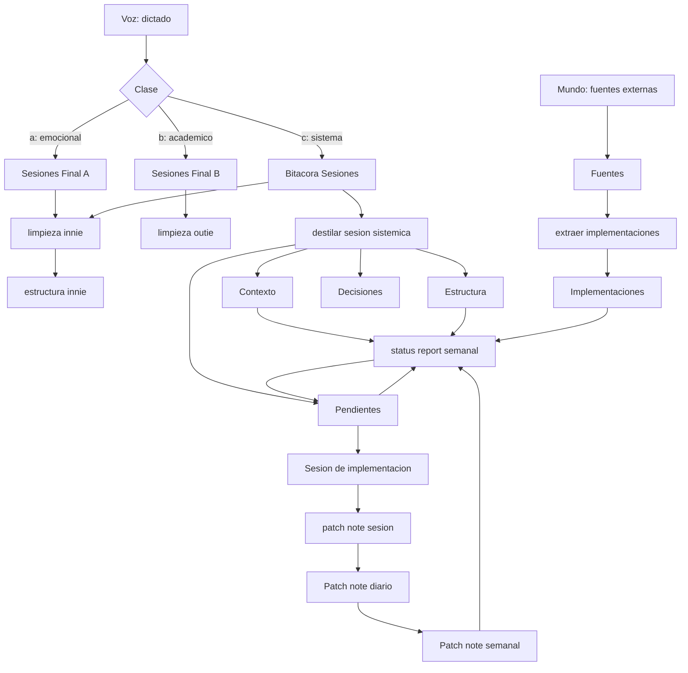
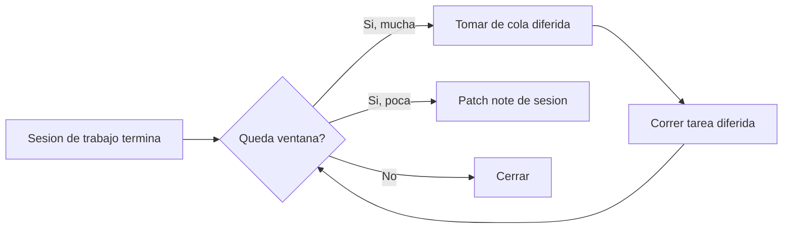
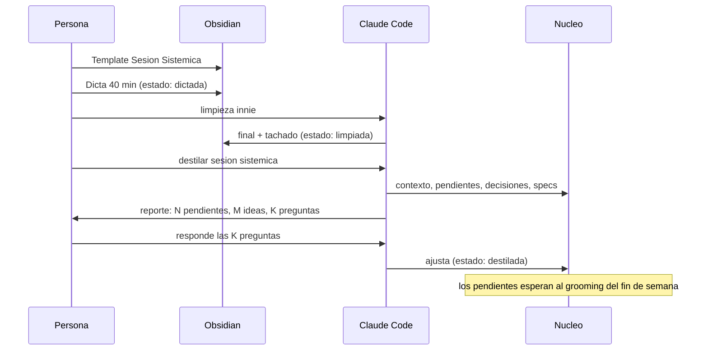

> Documento de diseño derivado de una sesión de pensamiento sistémico larga sobre el módulo de contexto e infraestructura. No reemplaza al archivo fuente: el fuente es la sesión de pensamiento (la materia prima, con su valor de procedencia y su contexto emocional intacto), y este es el producto sistémico que sale de procesarla. Todo lo que está acá abajo debería poder rastrearse a un párrafo de ese archivo, y todo lo que quedó sin resolver está listado explícitamente al final en vez de ser inventado.

## 0. Cómo leer este documento

Está dividido en siete partes, y no hace falta leerlas en orden:

1. **Diagnóstico sistémico** (§1): qué es realmente el archivo fuente, qué drivers se repiten, dónde están los stocks, los flujos, los bucles de realimentación y los puntos de apalancamiento. Es la parte teórica; si querés ir directo a lo accionable, saltala.
2. **La arquitectura propuesta** (§2): el Núcleo, sus cuatro cámaras, y el contrato de tokens. Esta es la decisión estructural más importante del documento.
3. **Planes de acción** (§3): dieciocho planes, uno por idea que nombraste. Cada uno tiene la misma estructura fija: qué dijiste, lectura sistémica, plan por fases, software y plugins, criterio de éxito, y modos de falla.
4. **Infraestructura, flows y workflows** (§4): los diagramas, las cadencias diaria/semanal/mensual, la cola de sesiones, el mapa de subagentes.
5. **Roadmap** (§5): en qué orden se hace todo esto sin morir en el intento.
6. **Riesgos y anti-patrones** (§6).
7. **Apéndices** (§7): tabla de software y plugins, esquemas de frontmatter, glosario canónico, esqueletos de `SKILL.md`, y preguntas abiertas que necesitan una decisión tuya.

Convención de este documento: cuando digo **debería** es una recomendación mía; cuando digo **decisión pendiente** es algo que no puedo decidir por vos sin arriesgarme a construir algo que después no usás.

---

## 1. Diagnóstico sistémico

### 1.1 El archivo fuente son tres documentos superpuestos

Lo primero que salta al analizarlo es que el módulo base no es un documento, son tres géneros distintos entrelazados, y eso importa porque cada uno necesita un destino diferente dentro del sistema:

| Capa | Qué es | Ejemplo del archivo | Destino natural |
|---|---|---|---|
| **Especificación** | Diseño concreto de módulos, carpetas, skills, flujos | "tres grandes carpetas", "patch note 13.5", "archivo auxiliar para cada skill" | `00.2 Estructura del sistema` |
| **Contexto personal** | Cómo trabajás, qué te friccionó antes, qué te desbloqueó | SuperWhisper vs Wispr Flow, los 20 minutos de corte, el miedo a que no funcione el dictado largo | `00.1 Contexto personal` |
| **Teoría de uso de IA** | Tu tesis sobre qué hace realmente valiosa a la IA | "no solo automatiza, quita esfuerzo cognitivo", "el pensamiento estratégico es lo que visibiliza la capacidad" | `00.3` o ensayo class b |

Esto ya da la primera regla de procesamiento: **una sesión de pensamiento sistémico no se archiva en un solo lugar, se distribuye a tres o cuatro destinos manteniendo el original intacto y linkeado**. El error de diseño más probable acá sería tratar el archivo como una unidad monolítica y guardarlo en una carpeta de "sesiones de sistema", porque entonces el conocimiento queda enterrado en prosa y el sistema no puede consumirlo.

La distinción es exactamente la que hace un compilador: el archivo fuente se conserva (es la procedencia, la fuente de verdad narrativa), pero lo que el sistema ejecuta es el artefacto compilado: entradas de contexto, pendientes tipados, y specs.

### 1.2 Los cinco drivers que se repiten

Leyendo el archivo entero, aparecen cinco constantes que actúan como función objetivo del sistema:

1. **Fricción mínima en la entrada.** Dictado por voz, sin teclado, sin decidir dónde va cada cosa antes de hablar.
2. **Contexto por encima de instrucción.** No un bullet point de diez palabras, tres mil palabras de contexto específico para esa tarea.
3. **Portabilidad.** El "corazón de Iron Man": si mañana cambiás de app, de bóveda, de modelo, te llevás una carpeta y el sistema revive.
4. **Trazabilidad y fecha.** Patch notes, "cuándo se actualizó por última vez esta skill", commits, sprints.
5. **Economía cognitiva sobre economía productivista.** No se trata de producir más, se trata de no gastar esfuerzo cognitivo en lo que tiene mal ratio.

Estos cinco drivers deberían vivir en un archivo propio y ser lo primero que cualquier skill de diseño lee, porque son el criterio con el que se resuelven los empates.

### 1.3 El problema central: el sistema todavía no tiene memoria de sí mismo

Comprimido en una frase: **el sistema produce conocimiento sobre el mundo, pero no produce conocimiento sobre sí mismo**. Hoy la bóveda sabe procesar una sesión de voz, pero no sabe qué skills existen sin leerlas todas, cuándo fue la última vez que cada pieza cambió, qué problemas siguen abiertos, qué se decidió y por qué, ni qué se rompió al agregar la última cosa.

En términos de teoría de sistemas: **falta el subsistema de auto-observación**. Un sistema sin auto-observación puede crecer, pero no puede corregirse, y a partir de cierto tamaño el costo de cada cambio empieza a crecer más rápido que el valor que agrega. El costo de instalarlo ahora, con el sistema chico, es de un fin de semana. Dentro de tres meses sería un proyecto en sí mismo.

### 1.4 Stocks y flujos

**Stocks** (acumulaciones que persisten): sesiones crudas dictadas, sesiones finales procesadas, skills y specs, contexto personal escrito (el más subdesarrollado y de mayor retorno), conocimiento técnico externo capturado (hoy disperso, fuera del sistema), pendientes e ideas (sin tipado ni procedencia), deuda estructural (hoy invisible).

**Flujos**: entrada por dictado (alto caudal, ya resuelto), procesamiento por skills de limpieza, destilación de sesión a contexto/pendiente/spec (**hoy inexistente, el cuello de botella**), gobierno de pendiente a implementación (manual hoy), purga de lo resuelto o descartado (**hoy inexistente, esto genera la basura informática**).

Diagnóstico cuantitativo: alto caudal de entrada y dos flujos de salida que no existen. Sin destilación, la captura es acumulación; sin purga, la acumulación es ruido.

### 1.5 Bucles de realimentación

**Bucle reforzador R1: contexto → velocidad → más contexto.** Cuanto más contexto escrito, menos hay que explicar, más rápido se implementa, más material se genera. Es el motor del sistema.

**Bucle reforzador R2: estructura → facilidad de agregar estructura.** Cada pieza documentada baja el costo marginal de la siguiente.

**Bucle de balance B1: crecimiento → carga de contexto → costo de tokens → freno.** Se controla con jerarquía de `CLAUDE.md` más índices baratos (wikis y sidecars).

**Bucle de balance B2: ambición de módulos → fragmentación → fricción de uso.** Se controla con nombres canónicos, índice único de skills, disparo automático por frontmatter.

**Bucle de balance B3: deuda estructural → costo de cambio → menos cambios → más deuda.** Se controla con el status report semanal, que es el sensor que cierra este bucle.

### 1.6 Puntos de apalancamiento, ordenados

| Nivel | Intervención | Prioridad |
|---|---|---|
| Bajo | Parámetros (plugins, modelo, niveles) | Baja |
| Medio | Estructura de stocks y flujos (carpetas del Núcleo) | **Alta** |
| Medio-alto | Bucles de balance (status report, patch notes) | **Alta** |
| Alto | Bucles reforzadores (contexto escrito, scaffolding) | **Máxima** |
| Alto | Flujo de información (wiki de skills, índices) | **Máxima** |
| Muy alto | Reglas del sistema (naming, contrato de tokens) | Alta |
| Muy alto | Auto-organización (crear una skill crea su ecosistema) | **Máxima** |
| Máximo | Objetivos y paradigma (los cinco drivers escritos) | Alta (barato) |

Conclusión: **el mayor retorno no está en crear más skills de procesamiento de contenido, está en crear el sustrato que hace que cada skill nueva se integre sola**. Es contraintuitivo porque no produce nada visible el día que se construye, pero es la diferencia entre un sistema que escala y uno que se atasca en el mes tres.

---

## 2. La arquitectura propuesta: el Núcleo

### 2.1 Principio de diseño

Separar tres cosas que hoy están mezcladas: **el sustrato** (cómo funciona el sistema), **el sujeto** (quién lo usa) y **el mundo** (qué se sabe afuera). Más una cuarta que produce movimiento: **la bitácora** (qué pasó).

Estas cuatro juntas son el corazón de Iron Man. Las tres primeras son estado; la cuarta es el motor. La prueba de que están bien construidas es la prueba de trasplante: copiás esa carpeta a una bóveda vacía, abrís Claude Code, y en cinco minutos el modelo sabe quién sos, cómo trabajás, qué hay construido y qué falta.

### 2.2 Estructura de carpetas concreta

```
00 - Nucleo/
├── CLAUDE.md                        ← contrato de lectura del núcleo
│
├── 00.1 - Contexto/                 ← el sujeto
│   ├── Drivers.md
│   ├── Perfil-Operativo.md
│   ├── Dispositivos-y-Contextos.md
│   ├── Cuadrantes-de-Vida.md
│   ├── Objetivos.md
│   ├── Historia-de-Sistemas.md
│   └── Puntos-de-Dolor.md
│
├── 00.2 - Estructura/                ← el sustrato
│   ├── Glosario.md
│   ├── Mapa-del-Sistema.md
│   ├── Convenciones-Naming.md
│   ├── Wiki-de-Skills.md
│   ├── Skills/
│   │   └── limpieza-innie.md
│   ├── Frontmatter-Schema.md
│   ├── Flujos.md
│   └── Integraciones.md
│
├── 00.3 - Conocimiento/              ← el mundo
│   ├── INDEX.md
│   ├── Fuentes/
│   ├── Implementaciones/
│   └── Radar.md
│
└── 00.4 - Bitacora/                  ← el motor
    ├── Sesiones/
    ├── Pendientes/
    │   ├── Activos.md
    │   ├── Ideas.md
    │   └── Cerrados.md
    ├── Patch-Notes/
    │   ├── Diarios/
    │   └── Semanales/
    ├── Decisiones/
    └── Auditorias/
```

### 2.3 Las tres velocidades del sistema

| Velocidad | Cadencia | Qué corre | Costo | Modelo |
|---|---|---|---|---|
| **Captura** | Continua | Dictado, limpieza, estructura, quotes | Bajo | Sonnet |
| **Destilación** | Diaria o cada dos días | Procesar sesión sistémica, extraer pendientes | Medio | Sonnet |
| **Gobierno** | Semanal o quincenal | Status report, auditoría, grooming | Alto | **Opus** |

El gobierno se corre al final de la ventana semanal, cuando el límite está por resetear; la captura se corre siempre; la destilación se mueve según el crédito disponible.

### 2.4 El contrato de tokens

**Nivel 0, siempre en contexto** (menos de 400 líneas totales): `CLAUDE.md` raíz, índice del núcleo, wiki de skills de una línea por skill.

**Nivel 1, a demanda por carpeta**: convenciones específicas, schema de frontmatter, sidecar de la skill en uso.

**Nivel 2, solo por invocación explícita**: sesiones completas, fuentes crudas, archivo histórico.

Regla operativa: **todo artefacto del sistema tiene que ser descubrible desde nivel 0 y legible en nivel 1 o 2, nunca al revés**. Si para saber que una skill existe hay que leerla, el diseño está mal.

---

## 3. Planes de acción por idea

Cada plan tiene la misma estructura: qué se dijo, lectura sistémica, plan por fases, software y plugins, criterio de éxito, y modos de falla. Numerados P01 a P18.

### P01. La unidad "Sesión de Pensamiento Sistémico"

**Qué se dijo.** Poder grabar sesiones de tres mil a ocho mil palabras hablando del sistema, sin que sea automático, disparado por una skill, que convierta eso en mejora en vez de en basura.

**Lectura sistémica.** No es un tipo de nota, es un **género documental nuevo** con ciclo de vida propio, distinto de las sesiones emocionales o intelectuales porque no busca preservarse en alta fidelidad: busca ser **consumida y destilada**. Recomendación: no crear una clase nueva, usar la clase de sistema existente con un subtipo `sesion-sistemica`, para no romper el routeo que ya funciona.

**Plan por fases.**

*Fase 1 — definir la unidad.* Ciclo de vida: `dictada` → `limpiada` → `destilada` → `cosechada`, como campo de frontmatter.

*Fase 2 — template.* Mismo mecanismo que el template de sesiones existente: calcula fecha, numeral romano, mueve el archivo.

*Fase 3 — prompt de apertura opcional.* Cinco preguntas guía ignorables: qué me está molestando, qué quiero que exista, qué probé y no funcionó, qué vi afuera que quiero traer, qué decidí y no escribí.

*Fase 4 — retroactivo.* La primera sesión sistémica del sistema es la que dio origen a este mismo documento.

**Software y plugins.** Templater (ya instalado). Dictado por voz. Nada nuevo.

**Criterio de éxito.** Abrir Obsidian, hablar cuarenta minutos, cerrar sin decidir dónde va cada cosa.

**Modos de falla.** Dictar sesiones y no correr nunca la destilación. Mitigación: el estado `dictada` sin destilar por más de siete días aparece como alerta en el status report semanal.

---

### P02. Skill de destilación de sesiones sistémicas

**Qué se dijo.** Procesar sin omitir ni borrar información; lo no relevante se deja abajo marcado, no se borra; agrupar por temática; extraer pendientes, ideas, dolores, emociones, objetivos, implementaciones; que quede como fuente citable.

**Lectura sistémica.** Es **la pieza más importante de todo el módulo**, el flujo de destilación que hoy no existe y sin el cual todo lo demás es acumulación. El modelo mental correcto no es "resumen", es **compilación con symbol table**: el fuente queda, y lo que se produce son artefactos tipados que apuntan a la línea del fuente de donde salieron.

**Plan por fases.**

*Fase 1 — taxonomía de extracción.* Siete tipos, cada uno con destino y formato fijo:

| Tipo | Qué es | Destino |
|---|---|---|
| `PENDIENTE` | Algo accionable | Pendientes activos |
| `IDEA` | Algo posible, sin compromiso | Ideas |
| `DOLOR` | Fricción concreta | Puntos de dolor |
| `CONTEXTO` | Hecho estable sobre vos | Contexto personal |
| `DECISION` | Elegido y descartado | Decisiones |
| `SPEC` | Diseño concreto de una pieza | Estructura |
| `TESIS` | Reflexión general | Candidato a ensayo |

Todo lo que no cae en ninguno queda en "material no clasificado", verbatim, nunca borrado.

*Fase 2 — la skill.* Nunca reescribe un archivo destino entero, siempre appendea o edita in place. Cada ítem lleva referencia al bloque exacto del fuente (block reference de Obsidian), no al archivo entero.

*Fase 3 — reporte de corrida.* Cuántos ítems de cada tipo, cuáles sin clasificar, qué preguntas quedan, todo consolidado al final.

*Fase 4 — calibración.* Primera corrida sobre la sesión original que dio origen a este documento, comparando el output esperado.

**Software y plugins.** Claude Code, Obsidian con block references, opcionalmente Dataview.

**Criterio de éxito.** Después de correrla, se puede olvidar la sesión y el sistema no perdió nada accionable.

**Modos de falla.** Sobre-extracción: cada frase se vuelve un pendiente. Mitigación: umbral explícito, "pendiente" solo si es accionable en menos de un día y fue formulado como falta, no como deseo.

---

### P03. Contexto personal

**Qué se dijo.** Contexto sobre la vida, cuadrantes, dispositivos, formatos, momentos, energía, fricción, tareas, objetivos. Más la historia: qué sistemas hubo antes, qué falló, qué drivers ayudan de verdad, cuáles fueron breakthroughs.

**Lectura sistémica.** El stock con **mayor retorno por palabra escrita de todo el sistema**, y el más vacío hoy: cada palabra acá se amortiza en cada sesión futura, para siempre. Tiene dos capas de vida útil distinta: la **estable** (quién sos, cómo trabajás) y la **viva** (qué molesta ahora). Mezclarlas es el error clásico; separarlas desde el día uno.

**Plan por fases.**

*Fase 1 — Drivers.* Los cinco drivers, dos o tres líneas cada uno con un ejemplo. Se lee siempre, máximo una página.

*Fase 2 — Dispositivos y contextos.* Sesión de dictado de veinte minutos.

*Fase 3 — Historia de sistemas.* Sesión de dictado de treinta a cuarenta minutos: qué se usó antes, qué falló y por qué, qué fue breakthrough. Sirve para que la IA reconozca un patrón antes de que se repita.

*Fase 4 — Puntos de dolor.* Archivo vivo: qué duele, dónde, cuánto, desde cuándo, estado. Se vacía al resolverse, y lo resuelto pasa a histórico con fecha.

*Fase 5 — Cuadrantes de vida y objetivos.* Pendientes viejos que desbloquean el frontmatter de sesiones a medio hacer.

**Software y plugins.** Ninguno nuevo. Dictado más Claude Code.

**Criterio de éxito.** Pasarle solo esta carpeta a una sesión nueva de Claude, sin más contexto, y que pueda responder correctamente preguntas concretas sobre qué te conviene.

**Modos de falla.** Escribir contexto aspiracional en vez de real. El contexto se dicta a partir de lo que efectivamente pasó, no de lo que se planea.

---

### P04. Estructura viva del sistema, wiki de skills y sidecars

**Qué se dijo.** Carpeta de información estructural: cómo se desarrollan las skills, propiedades, naming, integraciones, jerarquía. Una wiki que diga cuáles son las skills sin tener que leerlas. Un documento auxiliar por skill con objetivo y contexto que no hace falta leer cada vez que corre.

**Lectura sistémica.** Dos ideas técnicas resuelven el bucle de balance B1: **la wiki de skills es un índice barato** (el modelo sabe que algo existe sin pagar el costo de leerlo), y **el sidecar separa especificación de documentación** (el `SKILL.md` es lo que se ejecuta, corto e imperativo; el sidecar es por qué es así, decisiones descartadas, historial).

**Plan por fases.**

*Fase 1 — wiki de skills.* Una fila por skill: qué hace, cuándo se dispara, entrada, salida, versión, última edición. Regla de mantenimiento: se actualiza en la misma corrida en que se crea o edita una skill, nunca después.

*Fase 2 — sidecars.* Objetivo, decisiones de diseño, historial de calibraciones, casos límite, pendientes propios, changelog.

*Fase 3 — mapa del sistema.* Tabla de módulos con estado, dependencias, última actividad.

*Fase 4 — convenciones de naming y schema de frontmatter.* Un solo archivo con todos los campos válidos, su tipo y qué skill los lee.

*Fase 5 — integraciones.* GitHub, la página, Full Calendar, Obsidian CLI, Templater, con estado real.

**Software y plugins.** Dataview para autogenerar la wiki como query cuando haya más de una docena de skills; hasta entonces, tabla a mano.

**Criterio de éxito.** Una sesión nueva de Claude Code puede responder qué skills existen y cuál usar leyendo menos de cincuenta líneas.

**Modos de falla.** Desincronización silenciosa. La única mitigación real es el scaffolding automático (P16).

---

### P05. Conocimiento técnico vanguardista

**Qué se dijo.** Guardar información técnica y vanguardista sobre IA, second brain, Obsidian, Claude Code, del tipo que no está en el entrenamiento de los modelos porque es demasiado nueva. No resúmenes: implementaciones, nuevas maneras de mirarlo, una base de datos de implementaciones.

**Lectura sistémica.** Existe un tipo de conocimiento de **práctica emergente**: patrones que la gente está inventando ahora, sin manual, con vida media corta. La distinción "no resumen, implementaciones" merece formalizarse: **la unidad de captura no es el documento, es el patrón**. Un video de una hora puede producir un patrón útil, o quince; el resumen del video no sirve, el patrón sí, si está escrito como problema-solución-requisitos-aplicabilidad.

**Plan por fases.**

*Fase 1 — ficha de patrón.* Un archivo por patrón con campos de dominio, madurez, aplicabilidad y a qué se aplicaría en el sistema propio. El campo de aplicabilidad es el más valioso: permite descartar explícitamente.

*Fase 2 — skill de extracción.* No resume: recorre el material buscando patrones accionables. Segunda pasada obligatoria: cruzar cada patrón contra el mapa del sistema y decidir si ya existe, lo reemplazaría, es nuevo, o no aplica.

*Fase 3 — pipeline de entrada.* Una bandeja "radar" de una línea por cosa vista y no procesada. Si algo lleva un mes sin procesar, se borra sin culpa: es el flujo de purga que falta.

*Fase 4 — índice temático.* Autogenerado si se usa Dataview.

**Software y plugins.** Omnisearch (ya instalado) para búsqueda full-text; Dataview opcional para el índice.

**Criterio de éxito.** Preguntarle a Claude cómo hace la gente algo con Claude Code, y que la respuesta salga de la carpeta propia y sea más específica que la del modelo solo.

**Modos de falla.** Convertirse en un read-it-later gigante. Mitigación: radar con vencimiento y campo de aplicabilidad obligatorio.

---

### P06. NotebookLM sí o no: criterio de ruteo del material externo

**Qué se dijo.** Duda sobre si conviene mandar todo a NotebookLM para un resumen, o ponerlo en una carpeta propia, dependiendo del volumen y calidad de la información.

**Lectura sistémica.** No es una pregunta de preferencia, es de arquitectura: **cada uno resuelve un problema distinto**. NotebookLM es bueno para exploración conversacional sobre un corpus grande que no se va a integrar; su límite fatal es que lo que se aprende ahí no entra al sistema, no es consultable por las skills.

**Criterio de ruteo propuesto:**

| Situación | Destino |
|---|---|
| Alto volumen, baja densidad, exploratorio | NotebookLM, y solo el output útil vuelve como ficha de patrón |
| Baja densidad pero directamente aplicable | Directo a la carpeta de fuentes propias |
| Denso y corto | Directo a implementaciones, sin pasar por fuentes |
| Necesita ser consultable por skills | Siempre en la bóveda, nunca solo en el lente externo |

Regla de una línea: **NotebookLM es un lente, la bóveda es la memoria. Nada vive solo en el lente.**

**Software.** NotebookLM. Sin integración automática: el traspaso es manual, y está bien que lo sea porque el acto de copiar es el filtro.

---

### P07. Backlog sistémico trazable

**Qué se dijo.** Un archivo de pendientes sistémicos que se acumula durante la semana, se revisa el fin de semana, y cada pendiente queda linkeado a su journal de origen para tener contexto real, no una línea de diez palabras.

**Lectura sistémica.** Un ítem de backlog con puntero a tres mil palabras de contexto original es **un issue con especificación adjunta**: la IA puede resolverlo sola porque entiende el problema, no solo el título.

Estructura de tres archivos: **activos** (comprometidos, con esfuerzo y módulo), **ideas** (sin compromiso, pueden vivir meses), **cerrados** (hechos o descartados, con fecha y motivo — evidencia de progreso para el status report).

**Formato de ítem propuesto:** id correlativo tipo `KX-014`, módulo, tipo, esfuerzo, driver relacionado, link al bloque exacto de la fuente, fecha de creación.

**Plan por fases.** Migrar el backlog existente al formato tipado con ids. Conectar la skill de destilación para que escriba acá automáticamente. Ritual de grooming de fin de semana: cerrar lo hecho, promover ideas, matar lo que no aplica.

**Software y plugins.** Dataview para tener un tablero con queries por módulo, esfuerzo y driver sin mantenimiento manual. Se recomienda no mezclar esto con un gestor de tareas de vida personal, porque el valor está en la proximidad al contexto y esos gestores no pueden linkear a un bloque de la bóveda.

**Criterio de éxito.** Abrir un sábado, mirar una sola nota, saber exactamente qué hacer y por qué sin releer nada.

**Modos de falla.** Backlog que crece monótonamente. Mitigación: si un ítem estuvo tres grooming seguidos sin moverse, se hace, baja de prioridad, o se mata.

---

### P08. Auditoría sistémica semanal con el modelo más capaz

**Qué se dijo.** Una vez por semana o por mes, preguntarse qué está gustando, qué no, qué se podría mejorar; que un agente analice el sistema, la wiki y la información desde pensamiento sistémico y estratégico, corriendo con el modelo más potente disponible, aprovechando el momento en que los límites están por resetear.

**Lectura sistémica.** Es **el sensor que cierra el bucle de deuda estructural**, y probablemente la idea más valiosa de todo el archivo: es el único mecanismo que puede detectar problemas que la persona no notó. Todo lo demás procesa cosas ya señaladas; esto busca lo que no se señaló. Para funcionar necesita acceso cruzado a las cuatro cámaras del núcleo.

**Plan por fases.**

*Fase 1 — cinco pasadas.* Inventario (qué existe, qué se tocó), salud (qué se diseñó y nunca se usó, qué está sin destilar hace mucho), cruce dolor-estructura (¿algo construido debería resolver un dolor activo y no lo hace?), cruce mundo-sistema (¿algún patrón capturado afuera resuelve un dolor activo?), propuesta (tres a cinco acciones priorizadas con evidencia).

*Fase 2 — input personal.* Antes de correrla, cinco minutos de dictado: qué gustó, qué frustró, qué se evitó usar. Sin esto la auditoría es técnica pero ciega.

*Fase 3 — output.* Estado general en un párrafo, deuda detectada, acciones propuestas, y qué cambió respecto de la auditoría anterior.

*Fase 4 — política de modelo y momento.* Skill cara, de alto valor, corre en la ventana final del ciclo semanal de límites.

**Software y plugins.** Claude Code con el modelo más capaz disponible; subagentes en paralelo, uno por pasada, si la corrida se vuelve larga. Se recomienda correr varias veces a mano antes de automatizar el disparo, porque el valor está en calibrar qué sirve del output.

**Criterio de éxito.** Al menos una de las acciones propuestas cada semana es algo que no se le había ocurrido a la persona.

**Modos de falla.** Auditoría genérica. Mitigación: toda observación tiene que citar evidencia concreta con link a archivo; sin evidencia, no se reporta.

---

### P09. Patch notes: sesión, día, semana

**Qué se dijo.** Cada sesión larga de implementación es como una actualización, con su patch note, que dice qué módulos tocó; se combinan en un patch note del día y de la semana; cada módulo tiene una etiqueta de cuándo fue editado por última vez, para poder razonar sobre deuda por fechas.

**Lectura sistémica.** Resuelve dos problemas con el mismo artefacto: memoria para la persona (qué se hizo) y memoria para la IA (qué cambió desde la última vez). El razonamiento por fechas es inferencia sobre deuda, y solo es posible si las fechas existen. Git ya da parte de esto gratis; el patch note agrega la capa semántica que git no tiene: por qué cambió y qué quedó a medias.

**Plan por fases.**

*Fase 1 — versionado de módulos.* Cada módulo y skill lleva versión y fecha de última edición en su sidecar.

*Fase 2 — skill de patch note de sesión.* Lee el diff de git más la conversación, emite qué módulos se tocaron, qué cambió y por qué, y qué quedó a medias (la sección más valiosa: el contexto que se pierde entre sesiones).

*Fase 3 — agregación diaria y semanal.* El semanal es input directo de la auditoría.

*Fase 4 — "última edición" sin gastar tokens.* Recomendación: Dataview con la metadata de modificación del archivo. Cero mantenimiento, funciona retroactivamente sobre notas viejas, sin depender de que un plugin escriba el frontmatter en cada guardado.

**Software y plugins.** Git (en uso), Dataview, Claude Code.

**Criterio de éxito.** Abrir el patch note semanal y reconstruir la semana entera en dos minutos.

**Modos de falla.** Olvidarse de correrlo al final de la sesión. Mitigación: un hook del harness que lo genere o recuerde automáticamente.

---

### P10. Digest de pensamiento

**Qué se dijo.** A futuro, procesar las sesiones de pensamiento y decir al final del día o de la semana en qué se estuvo pensando, qué temáticas, qué archivos.

**Lectura sistémica.** No confundir con el patch note: el patch note es sobre lo que se hizo, el digest es sobre en qué se pensó. El valor real es **metacognitivo**: muestra la distribución de la atención, algo que nadie percibe bien desde adentro.

**Plan por fases.** Requiere taxonomía de temas antes que nada, idealmente derivada de los cuadrantes de vida para no duplicar taxonomías. Una skill que lea las sesiones de una fecha o semana y emita temáticas por volumen, personas mencionadas, preguntas abiertas, y qué cambió respecto de la semana anterior. Salida en markdown primero, HTML después, cuando el formato esté estable.

**Software y plugins.** Claude Code; Dataview opcional para conteo por etiquetas.

**Criterio de éxito.** Sorprender al menos una vez al mes mostrando un patrón de atención no notado.

**Modos de falla.** Baja prioridad real: buena idea, pero no está en el camino crítico. Se recomienda dejarla para una fase posterior del roadmap.

---

### P11. Terminología y ontología del sistema

**Qué se dijo.** El uso de "sistema", "metasistema", cinco niveles de sistemas distintos; que desarrollar terminología dentro del sistema es importante.

**Lectura sistémica.** En un sistema operado por lenguaje natural, **la terminología es la API**. Con veinte skills y cinco niveles de anidamiento, la degradación semántica se vuelve el principal costo de operación. Un glosario es la intervención de mayor apalancamiento por minuto invertido de toda la lista.

**Ontología propuesta** (a validar y ajustar):

| Término | Definición |
|---|---|
| Sistema | El ecosistema completo |
| Módulo | Un área funcional con propósito propio |
| Capa | Un nivel de procesamiento por el que pasa un mismo objeto |
| Skill | Una unidad ejecutable invocable |
| Flujo | Una composición nombrada de skills que corre como una sola cosa |
| Pipeline | El recorrido completo de un tipo de objeto de entrada a destino |
| Template | Un generador de archivos con estructura predefinida |
| Artefacto | Cualquier archivo producido por el sistema |
| Sidecar | Documentación auxiliar de un artefacto ejecutable |
| Núcleo | Las cuatro cámaras de contexto transplantables |
| Bandera | Marcador inline para tratar un segmento distinto |

Sugerencia: retirar "metasistema" del vocabulario operativo por ambigüedad, y usar "núcleo" para el sustrato transplantable, "sistema" para el todo.

**Plan de acción.** Escribir el glosario ajustado, y que el `CLAUDE.md` raíz apunte a él como fuente única de terminología canónica.

---

### P12. Matriz de dispositivos, contextos y fricción

**Qué se dijo.** Escribir un contexto sobre dispositivos, formatos, momentos, dinámicas, energía, niveles de fricción, tipo de tareas, objetivos por dispositivo.

**Lectura sistémica.** Es un **modelo de restricciones**: sin él, la IA propone soluciones ideales que no son ejecutables donde la persona está. También revela que distintos contextos tienen presupuestos de fricción distintos: algo aceptable en escritorio puede ser inviable caminando.

**Formato propuesto:** por dispositivo, contexto típico, energía, fricción tolerable, tareas que sí, tareas que no, software disponible, restricciones (permisos corporativos, VPN, políticas).

**Plan de acción.** Una sesión de dictado de veinte minutos respondiendo la matriz, destilada por el pipeline nuevo (primer uso real, sirve de calibración).

**Criterio de éxito.** Que la IA deje de proponer cosas no ejecutables en el contexto actual.

---

### P13. Portabilidad: el Núcleo como paquete transplantable

**Qué se dijo.** La metáfora del corazón de Iron Man: la carpeta se traslada a una bóveda nueva y es el engranaje principal.

**Lectura sistémica.** La portabilidad no se logra escribiendo, se logra **respetando restricciones de formato desde el día uno**. Mucho más barato diseñar portable que portar después.

**Restricciones concretas:** markdown plano y frontmatter YAML estándar; links relativos; skills comiteadas al repo, no en configuración local de usuario; un manifiesto en la raíz del núcleo que diga qué contiene y en qué orden leerlo; sin rutas absolutas específicas de un sistema operativo.

**Plan de acción.** Escribir el manifiesto. Agregar las reglas de portabilidad a las convenciones. **Prueba de trasplante trimestral**: copiar el núcleo a una carpeta vacía, abrir una sesión nueva ahí, y preguntarle cinco cosas sobre el sistema y la persona. Lo que no pueda responder es lo que falta documentar.

**Criterio de éxito.** La prueba de trasplante pasa con cinco de cinco.

**Modos de falla.** Acoplamiento silencioso: una skill del núcleo que asume que existe una carpeta de contenido específica. El núcleo puede referenciar carpetas de contenido, pero ninguna skill del núcleo debe requerir que existan para funcionar.

---

### P14. Economía de tokens, sesiones y créditos

**Qué se dijo.** Tareas en cola para correr cuando una sesión está por acabarse; conviene usar un poco todos los días en vez de esperar al último; los créditos extra hay que asignarlos; la auditoría conviene correrla cuando el límite semanal está por resetear.

**Lectura sistémica.** Ya hay una gestión intuitiva y sofisticada de recursos. Formalizarla evita tener que acordarse y permite que la IA participe de la decisión. Hay tres recursos con dinámicas distintas: la ventana de sesión (se pierde si no se usa, costo de oportunidad alto), el límite semanal (mismo razonamiento a otra escala), y los créditos (no se resetean pero vencen).

**Políticas propuestas:** con remanente de ventana, correr la cola de tareas diferidas; con remanente semanal, correr la auditoría; los créditos con vencimiento se asignan con presupuesto mensual explícito, escrito; las tareas caras se marcan en la wiki de skills con un campo de costo para poder rutear.

**Plan de acción.** Crear una cola de tareas diferidas (generar diagramas, procesar fuentes pendientes, generar sidecars faltantes, correr limpieza sobre archivos viejos). Agregar el campo de costo a la wiki. Escribir el presupuesto de créditos con fecha de vencimiento visible.

**Criterio de éxito.** No llegar al vencimiento de los créditos con saldo sin usar.

---

### P15. Dictado como capa de entrada consolidada

**Qué se dijo.** Contraste entre dos herramientas de dictado: una que corta a los veinte minutos sin aviso y parsea mal los párrafos en bloques sin puntuación cuando se habla rápido, y otra que resolvió sesiones de más de diez minutos sin problema, guarda todo local, y es customizable con diccionario propio.

**Lectura sistémica.** No es una anécdota, es una **decisión de arquitectura de la capa de entrada**. Si la premisa sobre cuál es la herramienta principal cambió, todas las skills de limpieza calibradas contra las patologías del transcriptor anterior quedan calibradas contra un problema que quizás ya no existe. Es exactamente el tipo de deriva silenciosa que la auditoría semanal debería detectar.

**Plan de acción.** Decidir el ruteo por caso de uso (sesiones largas versus dictado corto e inline) y documentarlo en la matriz de dispositivos. Actualizar la premisa en el `CLAUDE.md` raíz si cambió. Diccionario compartido con los casos de dictado ya identificados, más nombres propios y terminología del sistema: corregir en la fuente es infinitamente más barato que corregir en el pipeline. Mantener el diccionario en la bóveda como fuente de verdad, aunque también se copie a la app. Re-calibrar la skill de limpieza cuando el input entrante venga más limpio.

**Criterio de éxito.** Poder dictar cuarenta minutos sin mirar la pantalla y sin miedo a perder material.

---

### P16. Scaffolding automático: crear una cosa crea su ecosistema

**Qué se dijo.** "Creaste la skill en dos segundos, pero además te creó todo el sistema alrededor de eso." Al crear una skill nueva, se actualiza la lista de skills y se agrega su archivo auxiliar.

**Lectura sistémica.** Esto es **auto-organización**, el segundo punto de apalancamiento más alto de la escala de intervención en sistemas, y es lo que separa un sistema que escala de uno que acumula deuda. El costo de mantener coherencia se paga en el momento de la creación, cuando ya se está en contexto y cuesta casi nada, en vez de pagarse después en una tarea de limpieza que nunca se hace. Es la mitigación estructural de casi todos los modos de falla listados en este documento.

**Plan por fases.**

*Fase 1 — skill de creación de skills.* Un solo paso que: crea el archivo ejecutable con el esqueleto canónico, crea el sidecar con objetivo y changelog inicializado, agrega la fila a la wiki, agrega la entrada al mapa del sistema, agrega campos de frontmatter nuevos al schema si corresponde, genera la entrada de patch note.

*Fase 2 — equivalentes.* Mismo mecanismo para crear un módulo, un template, un flujo.

*Fase 3 — hooks del harness.* Los hooks corren siempre, no cuando la IA se acuerda: recordatorio o generación automática del patch note al terminar una sesión; verificación de que la wiki esté sincronizada al editar una skill; validación de estilo (por ejemplo, una regla de formato definida como dura y sin excepciones corresponde al harness, no solo al prompt).

**Criterio de éxito.** Pasan dos meses, hay veinte skills, y la wiki sigue al día sin ninguna tarea de mantenimiento manual.

**Modos de falla.** Sobre-scaffolding: crear seis archivos por cada cosa chica. El scaffolding tiene que ser proporcional al tamaño de lo que se crea.

---

### P17. Bajar la distancia entre idea y prototipo

**Qué se dijo.** Nunca hubo un momento en el mundo donde una idea pudiera convertirse en prototipo en un fin de semana; con archivos, contexto y dictado combinados, esa distancia se derrumbó.

**Lectura sistémica.** Cierto, y lo que falta para explotarlo es **un lugar donde los prototipos puedan vivir sin contaminar el sistema**. Sin eso, cada prototipo o se hace bien (caro, no se hace) o ensucia la estructura (barato, acumula deuda). Un área de prototipos con política de vencimiento rompe ese dilema.

**Plan de acción.** Formalizar la carpeta de pruebas existente con la regla de que nada ahí es fuente de verdad y todo tiene fecha de vencimiento. Regla de vencimiento: un prototipo de más de treinta días o se promueve con scaffolding completo, o se borra. Una skill de promoción que aplica el scaffolding a lo que valió la pena. Para prototipos visuales o de interfaz, un artefacto autocontenido publicable en un click es el camino más corto.

---

### P18. Git, GitHub y visualización HTML

**Qué se dijo.** HTMLs conectados a git para visualizar cosas del sistema; los commits le dan historia a la IA; digests HTML del aprendizaje; visualización de flujos con diagramas.

**Lectura sistémica.** Tres cosas separadas que conviene distinguir: **git como historial** (infraestructura base, ya en curso), **HTML como salida de lectura** (valor de presentación, depende de que el contenido esté estable primero) y **diagramas versionables como texto**, que es la opción de mayor apalancamiento para diagramas de flujo del sistema: texto plano, se versiona en git, se renderiza nativo tanto en Obsidian como en páginas web, sin generar ni mantener HTML aparte.

**Plan de acción.** Diagramas de flujo del sistema como texto versionable, sin infraestructura nueva (este mismo documento, cuando se lea en la web, los renderiza en vivo). Un dashboard del sistema, generado a partir del frontmatter una vez que el contenido esté estable, publicado como página autocontenida navegable desde cualquier dispositivo. La visualización animada de flujos, correctamente baja prioridad: el diagrama estático versionado ya cubre la mayor parte del valor con una fracción del esfuerzo.

---

## 4. Infraestructura sistémica, flows y workflows

### 4.1 Mapa general del sistema propuesto



Los dos nodos que hoy no existen (destilación y auditoría) son los que cierran el sistema. Todo lo demás ya existe o es incremental.

### 4.2 Las cuatro cadencias

**Diaria (5 a 15 minutos).** Dictar lo que aparezca en cualquier momento; al final del día, correr la limpieza batch existente; si hubo sesión de implementación, correr el patch note de sesión. La destilación sistémica no corre todos los días, solo cuando hubo sesión sistémica.

**Semanal, fin de semana (45 a 60 minutos).** Dictar cinco minutos sobre qué gustó y qué frustró. Correr la auditoría con el modelo más capaz, aprovechando el reset de límite. Leer la auditoría. Grooming del backlog: cerrar, promover, matar. Elegir tres acciones para la semana. Patch note semanal. Este es el ritual que sostiene todo el sistema.

**Mensual (30 minutos).** Revisar si el contexto personal sigue siendo cierto. Purgar el radar de conocimiento externo de lo que lleva más de un mes. Revisar ideas para promover o matar. Presupuesto de créditos del mes.

**Trimestral (1 hora).** Prueba de trasplante del núcleo. Revisión de deuda estructural acumulada. ¿Sigue teniendo sentido la arquitectura de módulos?

### 4.3 Workflow de la cola diferida



Una tarea diferible tiene valor, no tiene urgencia, y no requiere decisiones durante la corrida. Esa última condición es la que importa: una tarea que va a preguntar cosas no sirve para llenar ventana sobrante.

### 4.4 Mapa de subagentes

| Caso | ¿Subagente? | Por qué |
|---|---|---|
| Auditoría semanal, una pasada por cámara del núcleo | **Sí** | Cuatro barridos independientes, se paralelizan bien |
| Destilar una sesión | No | Necesita el documento entero en un solo contexto coherente |
| Extraer implementaciones de varias fuentes | **Sí**, uno por fuente | Independientes entre sí |
| Buscar dónde está algo en la bóveda | **Sí** | Fan-out de búsqueda |
| Patch notes | No | Rápido, necesita el contexto de la sesión recién terminada |

### 4.5 Git como columna vertebral

Todo comiteado, incluido el contenido personal, en un repo privado: las skills ejecutables (portabilidad), el núcleo completo (tiene que tener historia), y el contenido, salvo lo que explícitamente no deba salir nunca de la máquina, que se anota en el manifiesto. La auditoría gana poder real leyendo el historial completo de commits.

### 4.6 Diagrama del flujo de una sesión sistémica



---

## 5. Roadmap

Ordenado por apalancamiento y dependencias, no por entusiasmo.

### Fase 0 — fundación (un fin de semana, 4 a 6 horas)

Crear la estructura del núcleo con sus cuatro cámaras. Escribir los cinco drivers. Escribir la ontología del sistema. Escribir la wiki de skills de las skills existentes. Migrar el backlog existente con ids. Escribir el contrato de tokens del núcleo. Actualizar el `CLAUDE.md` raíz. Instalar Dataview.

Resultado: el sistema ya sabe qué es y qué tiene. Todavía no se auto-mejora, pero deja de re-derivarse en cada sesión.

### Fase 1 — el motor (segunda semana, 4 a 5 horas)

Template de sesión sistémica y su ciclo de vida. Skill de destilación, calibrada contra la sesión original. Historia de sistemas y matriz de dispositivos vía dictado, usando el pipeline nuevo. Versionado y patch note de sesión.

Resultado: el bucle está cerrado. Se piensa, se destila, se acumula, se ejecuta, se registra.

### Fase 2 — el gobierno (tercera semana, 3 a 4 horas)

Skill de auditoría y primera corrida con el modelo más capaz. Sidecars, mapa del sistema, schema de frontmatter. Primer ritual completo de fin de semana. Políticas de recursos y cola diferida.

Resultado: el sistema empieza a detectar cosas que la persona no notó.

### Fase 3 — el mundo y la escala (cuarta semana en adelante)

Carpeta de conocimiento y skill de extracción de implementaciones. Criterio de ruteo hacia herramientas externas de resumen. Scaffolding automático y hooks. Agregación semanal de patch notes, última edición vía Dataview. Manifiesto y primera prueba de trasplante.

### Fase 4 — refinamiento (cuando haya ganas)

Digest de pensamiento. Política de prototipos. Diagramas versionables ahora, dashboard después. Cerrar los pendientes viejos que este módulo desbloquea.

La fase 0 sola ya justifica el esfuerzo, incluso si nunca se hace el resto.

---

## 6. Riesgos, modos de falla y anti-patrones

**Riesgo 1 — construir el sistema en vez de usarlo.** El más probable y el más peligroso, porque se siente productivo. Señal de alarma: dos semanas seguidas donde toda la actividad fue sobre el sistema y ninguna sobre el resto de los proyectos. Mitigación: la auditoría semanal reporta la distribución de actividad por proyecto.

**Riesgo 2 — sobre-estructuración prematura.** Diseñar taxonomías de veinte categorías antes de tener veinte objetos que clasificar. Mitigación: **regla de tres** — no se crea una categoría hasta que existan tres instancias reales que la necesiten.

**Riesgo 3 — desincronización de la documentación.** La wiki dice una cosa y las skills hacen otra. Mata a todos los sistemas de este tipo, y el daño es peor que no tener documentación porque el modelo confía en ella. Mitigación: scaffolding automático y hooks; la disciplina sola no alcanza.

**Riesgo 4 — el pantano de captura.** Se captura más de lo que se destila. Mitigación: reglas de vencimiento explícitas en todos los stocks de entrada, reportadas como número visible en el status report.

**Riesgo 5 — acoplamiento del núcleo al contenido.** Se detecta con la prueba de trasplante trimestral. Barato de detectar, caro de arreglar si se deja pasar seis meses.

**Riesgo 6 — el sistema tiene un solo usuario y ese usuario tiene semanas malas.** No todo se resuelve con arquitectura. Mitigación de diseño: ningún proceso puede requerir que el anterior haya corrido. Si se saltean dos semanas de auditoría, la tercera tiene que poder correr igual y cubrir tres semanas.

### Anti-patrones a evitar explícitamente

| Anti-patrón | Por qué es tentador | Por qué no |
|---|---|---|
| Un archivo de contexto raíz gigante | Todo siempre disponible | Costo de tokens en cada sesión, pérdida de foco |
| Automatizar antes de calibrar | Se siente avanzado | Se producen archivos que no se leen, el error se multiplica |
| Una skill por cada cosa | Se siente ordenado | Ninguna se recuerda usar |
| Taxonomía perfecta antes de datos | Se siente riguroso | Se rehace igual al primer contacto con la realidad |
| Métricas por defecto | Se siente medible | Mide lo fácil, no lo importante |

---

## 7. Apéndices

### 7.1 Tabla de software y plugins

**Ya instalado y en uso:** Obsidian, Claude Code, Templater (templates de sesiones), Omnisearch (búsqueda full-text), Full Calendar (timeline de sesiones), git y GitHub (historial, portabilidad, input de auditoría), herramienta de dictado por voz.

**A instalar, en orden de prioridad:** Dataview (alta prioridad — backlog consultable, última edición sin plugin extra, índices autogenerados), hooks del harness para validación de estilo y patch notes automáticos (media prioridad), un plugin de actualización automática de fecha de modificación en frontmatter (baja prioridad, Dataview cubre la mayoría del caso), un plugin de tareas con checkboxes y recurrencia (baja prioridad, Dataview alcanza y es más portable).

**Servicios externos:** una herramienta de resumen conversacional sobre corpus grandes (lente exploratorio, nada vive solo ahí), artefactos autocontenidos para dashboards y prototipos visuales (solo presentación, nunca fuente de verdad), un gestor de tareas de vida personal (los pendientes del sistema no van ahí).

### 7.2 Esquema de frontmatter propuesto para el núcleo

```yaml
# Sesión sistémica
---
clase: c
subtipo: sesion-sistemica
titulo: ""
estado_stream: original
estado_sistemico: dictada
modulos_tocados: []
destilado_en: []
date: "2026-07-25"
---

# Ficha de implementación
---
patron: ""
fuente: ""
dominio: []
madurez: experimental
aplicabilidad: media
implementado_en: []
fecha_captura: 2026-07-25
---

# Sidecar de skill
---
skill: nombre-skill
version: 1.0
estado: en uso
costo: bajo
ultima_edicion: 2026-07-25
depende_de: []
---
```

Todos estos campos van a un único archivo de schema como fuente de verdad. Ningún campo se inventa en un template sin registrarse ahí.

### 7.3 Esqueleto canónico de una skill

```
Nombre de la skill

Cuándo se dispara
Automático: condición de frontmatter. Manual: frase típica.

Entrada
Qué archivos, en qué estado.

Proceso
Pasos numerados.

Salida
Qué archivos produce, dónde, con qué frontmatter.

Reglas duras
Las que no se negocian.

Reporte final
Qué informa al terminar, en qué formato.
```

Todo lo demás (por qué es así, qué se descartó, historial, casos límite) va al sidecar, no al ejecutable.

### 7.4 Preguntas abiertas que necesitan una decisión

Ordenadas por cuánto bloquean el resto:

1. **¿"Núcleo" o "Módulo Base" como nombre de la carpeta?** Bloquea la creación de todo. Renombrar después rompe wikilinks.
2. **¿La sesión sistémica es una clase existente con subtipo, o una clase enteramente nueva?** Recomendación: subtipo. Bloquea el template y la skill de destilación.
3. **¿La taxonomía de siete tipos de extracción cierra tal como está?** Aplicar la regla de tres antes de agregar categorías.
4. **¿Cuál herramienta de dictado queda para qué caso, y en qué dispositivo está cada una?** El contexto raíz afirma una herramienta como principal y la sesión de origen describe haber resuelto un problema con otra distinta; sin poder verificar cuál está instalada dónde, esto queda pendiente de confirmación directa.
5. **¿Se comitea el contenido personal al repo o solo el núcleo y las skills?** Bloquea el alcance real de la auditoría.
6. **¿Se retira "metasistema" del vocabulario operativo?** Bloquea el glosario final.
7. **¿Qué día y a qué hora es el ritual semanal?** Un ritual sin horario fijo no sobrevive al segundo mes.
8. **¿Cuál es el presupuesto de créditos por mes?** Los créditos disponibles tienen fecha de vencimiento; sin asignación explícita, se pierden sin usar.

---

## Cierre: qué es realmente este módulo

El resto del sistema procesa contenido: toma lo dicho y lo convierte en algo mejor formado. Este módulo hace otra cosa: **toma el sistema y lo convierte en algo que puede mejorarse a sí mismo**. Es la diferencia entre tener herramientas y tener un taller. Las herramientas hacen cosas; el taller hace herramientas.

A partir del momento en que el núcleo existe, cada hora dedicada al sistema rinde más que la anterior, porque la anterior dejó estructura escrita que la siguiente no tiene que re-derivar. Ese es el motor, y es el único motivo por el que vale la pena pagar el costo de la fundación antes de seguir agregando funciones nuevas.
